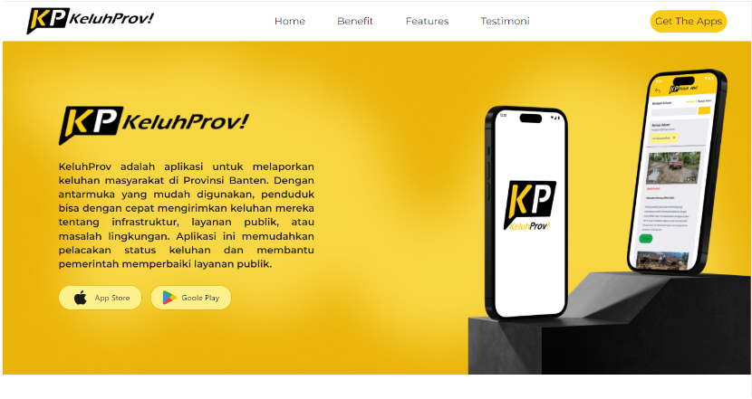

# Capstone Project: E-Complaint

## About Project
E-Complaint adalah aplikasi yang membantu pengguna untuk membuat pengaduan terkait pelayanan publik. Aplikasi ini digunakan oleh end user, admin, dan superadmin. End user dapat membuat keluhan sementara admin dapat mengelola pengumuman/berita dan menangani keluhan dari end user. Superadmin memiliki kemampuan untuk mengelola akun user dan admin.

## Features (MVP)
### Admin & Superadmin
1. Halaman landing page
2. Dashboard
3. Melakukan managemen aduan
4. Mengelola berita terkait pelayanan publik
5. Memberikan umpan balik dari berita
6. Mengelola kategori aduan

### Superadmin
1. Managemen akun user dan admin

## Tech Stacks
### Tools
- VSCode
- Figma
- Postman
- GitHub
- Vite
- Tailwind
- MUI Material
- SweetAlert2

### Library
- ReactJS
- Redux
- React Router DOM
- PrimeReact
- Axios

## Live App Demo
[Link demo app](https://e-complaint-website.vercel.app)

## Setup
Pada dashboard admin akan melihat dashboard yang berisi ringkasan statistik pengaduan dan informasi terkini mengenai pengumuman atau berita. Admin dapat melakukan manajemen aduan, mengelola berita terkait pelayanan publik, memberikan umpan balik dari berita, serta mengelola kategori aduan. Superadmin memiliki akses untuk mengelola akun user dan admin.

**_Tampilan Website:_**

